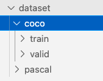

# Training
## Bộ dữ liệu: PASCAL VOC 2012
- Nếu có sử dụng CUDA:
```python
    python main.py --dataset_file pascal --data_path ../dataset/pascal --output_dir output
```
- Nếu không sử dụng CUDA:
```python  
    python main.py --dataset_file pascal --data_path ../dataset/pascal --output_dir output --device cpu
```
## Bộ dữ liệu COCO 2017
- Do bộ dữ liệu COCO khá lớn nên không thể đưa lên Github. Trước khi train cần download bộ dữ liệu này về theo hướng dẫn sau:

- Địa chỉ Bộ dữ liệu: https://public.roboflow.com/object-detection/microsoft-coco-subset/2, chọn Định dạng COCO Json, chọn tuỳ chọn download zip to computer, và tải về máy tính.
- Tạo thư mục con coco trong thư mục dataset
- Xả nén file vừa tải về vào thư mục: dataset/coco, sao cho trong thư mục coco có 2 thư mục con là train và valid.


- Nếu có sử dụng CUDA:
```python
    python main.py --dataset_file coco --data_path ../dataset/coco --output_dir output
```
- Nếu không sử dụng CUDA:
```python  
    python main.py --dataset_file coco --data_path ../dataset/coco --output_dir output --device cpu
```